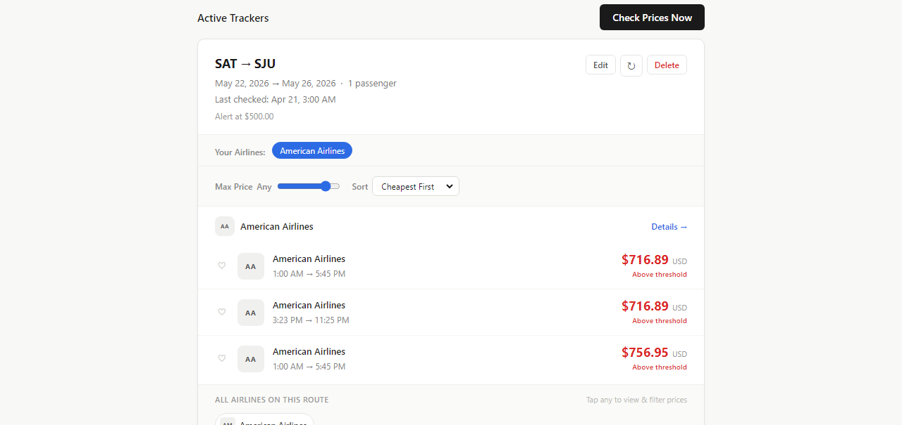
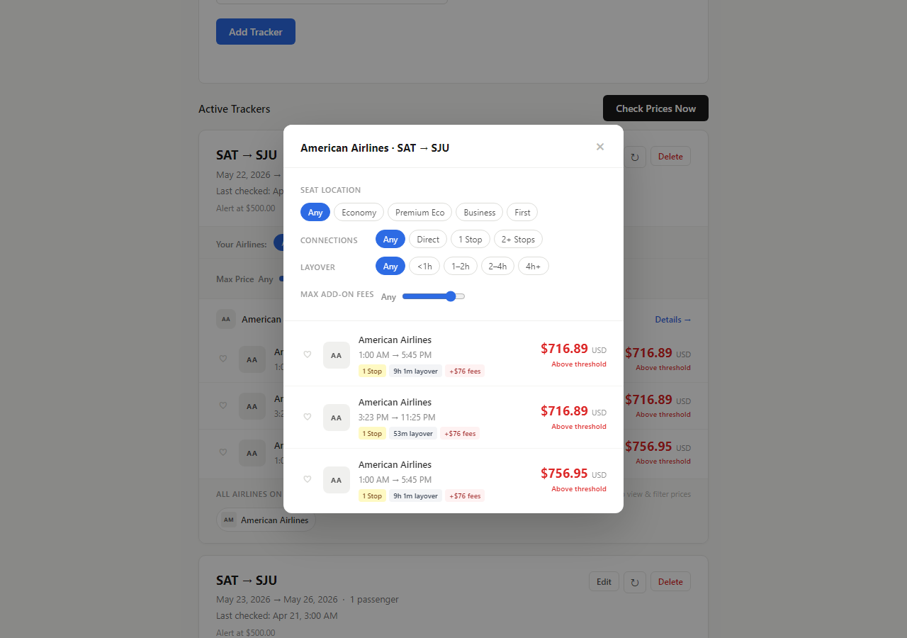

# Flight Price Tracker

A Node/Express backend that watches flight prices for you. Set a route, dates, and a price threshold; a cron job checks real fares twice a day via the Duffel API and emails or texts you the moment one drops below it.

**[Live demo →](https://flight-tracker-production-4d40.up.railway.app/)** · **[Repo](https://github.com/NnaHill/flight-tracker)**



---

## What it does

1. **You add a tracker** — origin, destination, dates, passenger count, and a price threshold — and pick email, SMS, or both for alerts.
2. **A cron job checks prices** at 8 AM and 8 PM daily (or on demand, via a rate-limited manual-check endpoint), querying the [Duffel](https://duffel.com/) flight-offers API for real fares and keeping the three cheapest offers per airline.
3. **Every result is saved to price history** — full detail per offer: airline, flight number, departure/arrival times, stops, layover duration, base fare vs. taxes, and cabin class.
4. **If a fare beats the threshold, an alert fires** — but only once per 24 hours per tracker, so a search that stays cheap for days doesn't spam you.
5. **The frontend renders live, filterable results** — an airline detail modal lets you filter by seat class, number of stops, layover length, and add-on fees, with a heart to favorite specific flights.



## Features

- **Real fare data, not mocked** — every price comes from Duffel's live offer-search API, including per-segment layover math computed from actual arrival/departure timestamps.
- **Per-airline deduplication.** Duffel can return dozens of offers for one route; the app keeps the 3 cheapest *per airline* so the results stay scannable instead of one airline flooding the list.
- **24-hour alert dedup**, checked against `alerts_log` before sending — a fare that stays under threshold across multiple cron runs triggers exactly one email/SMS, not one per check.
- **Rate-limited API** — a general limiter on every route, plus a stricter 5-per-15-minutes limit on manually-triggered price checks (each one is a real, metered Duffel API call).
- **Server-side input validation** on every write — IATA codes checked against a 3-letter regex, dates checked for validity and that departure is in the future, passenger count bounded 1–9, threshold required positive.
- **Resilient DB connection** — the MySQL pool retries on startup with backoff before failing loudly, rather than serving requests against a connection that was never established.
- **A frontend built around explicit design principles** — the vanilla JS client is split into an `ApiService`, `StateManager`, `FilterService`, and `Renderer`, each documented with the SOLID principle it exists to satisfy (see `public/app.js`) — new filters, for example, are added as one config object with no changes to the code that applies them.

## Tech stack


- **Backend:** Node.js + Express, with [`node-cron`](https://www.npmjs.com/package/node-cron) driving the scheduled price checks.
- **Data:** MySQL (via `mysql2/promise`), three core tables — `search_queries`, `price_history`, `alerts_log` — with foreign keys and `CHECK` constraints (valid passenger counts, return date after depart date) enforced at the schema level.
- **Flight data:** [Duffel API](https://duffel.com/) for live flight-offer search.
- **Alerts:** [Nodemailer](https://nodemailer.com/) (email) and [Twilio](https://www.twilio.com/) (SMS).
- **Frontend:** Vanilla HTML/CSS/JS — no framework, no build step.
- **Hosting:** [Railway](https://railway.app/), with `pm2`-style process config (`ecosystem.config.js`) for production process management.

## Project structure

```
.
├── server.js                # Express app, middleware, route mounting, cron startup
├── routes/
│   ├── queries.js           # CRUD for tracked searches, with full input validation
│   ├── prices.js            # Price history + manual per-query check
│   └── jobs.js               # Manually trigger a full price-check run (rate-limited)
├── jobs/
│   └── priceChecker.js       # The cron job — checks every active query, saves, alerts
├── services/
│   ├── duffelClient.js        # Duffel SDK client init
│   ├── flightService.js        # Offer search + per-airline dedup
│   ├── alertService.js          # Threshold check + 24h alert dedup
│   ├── emailService.js           # HTML email via Nodemailer
│   └── smsService.js              # SMS via Twilio
├── db/
│   ├── connection.js         # MySQL pool with retry-on-startup
│   └── queries.js             # All SQL, in one place
├── database/
│   └── schema.sql            # Table definitions, constraints, indexes
└── public/
    ├── index.html            # Tracker form + active-tracker list
    ├── app.js                 # ApiService / StateManager / FilterService / Renderer
    └── style.css
```

## Running locally

```bash
git clone https://github.com/NnaHill/flight-tracker.git
cd flight-tracker
npm install
```

Create a `.env` file (see the required variables below), create the database with `database/schema.sql`, then:

```bash
npm run dev
```

Required environment variables: `DB_HOST`, `DB_PORT`, `DB_USER`, `DB_PASSWORD`, `DB_NAME`, a Duffel API key, `EMAIL_USER` / `EMAIL_APP_PASSWORD` for Nodemailer, and `TWILIO_ACCOUNT_SID` / `TWILIO_AUTH_TOKEN` / `TWILIO_PHONE_NUMBER` for SMS. Set `FORCE_ALERT_TEST=true` to bypass the price-threshold check while testing the alert pipeline end to end.

## Author

Built by [NnaHill](https://github.com/NnaHill).
